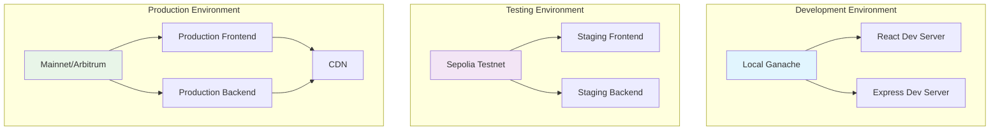

# Deployment Strategy - Blockchain Voting System

## Overview

This document outlines the comprehensive deployment strategy for the Blockchain Voting system, covering development, testing, staging, and production environments.

## Deployment Architecture



## 1. Environment Configuration

### 1.1 Development Environment

**Blockchain**: Local Ganache
**Frontend**: React development server
**Backend**: Express development server

#### Configuration:
```env
# contracts/.env
NETWORK_ID=5777
RPC_URL=http://127.0.0.1:7545
PRIVATE_KEY=your_ganache_private_key

# frontend/.env
REACT_APP_CONTRACT_ADDRESS=0x...
REACT_APP_NETWORK_ID=5777
REACT_APP_RPC_URL=http://127.0.0.1:7545

# backend/.env
PORT=3001
NODE_ENV=development
CONTRACT_ADDRESS=0x...
```

#### Deployment Steps:
1. Start Ganache: `ganache-cli`
2. Deploy contracts: `cd contracts && npm run deploy`
3. Update contract addresses in .env files
4. Start backend: `cd backend && npm run dev`
5. Start frontend: `cd frontend && npm start`

### 1.2 Testing Environment

**Blockchain**: Sepolia Testnet
**Frontend**: Vercel/Netlify staging
**Backend**: Railway/Heroku staging

#### Configuration:
```env
# contracts/.env
NETWORK_ID=11155111
RPC_URL=https://sepolia.infura.io/v3/YOUR_PROJECT_ID
PRIVATE_KEY=your_testnet_private_key
ETHERSCAN_API_KEY=your_etherscan_api_key

# frontend/.env
REACT_APP_CONTRACT_ADDRESS=0x...
REACT_APP_NETWORK_ID=11155111
REACT_APP_RPC_URL=https://sepolia.infura.io/v3/YOUR_PROJECT_ID

# backend/.env
PORT=3001
NODE_ENV=staging
CONTRACT_ADDRESS=0x...
```

#### Deployment Steps:
1. Deploy contracts to Sepolia: `truffle migrate --network sepolia`
2. Verify contracts: `truffle run verify --network sepolia`
3. Deploy backend to staging platform
4. Deploy frontend to staging platform
5. Update DNS/domain configuration

### 1.3 Production Environment

**Blockchain**: Ethereum Mainnet or Arbitrum
**Frontend**: Vercel/Netlify production
**Backend**: AWS/Railway production
**CDN**: CloudFlare

#### Configuration:
```env
# contracts/.env
NETWORK_ID=1  # Mainnet or 42161 for Arbitrum
RPC_URL=https://mainnet.infura.io/v3/YOUR_PROJECT_ID
PRIVATE_KEY=your_production_private_key
ETHERSCAN_API_KEY=your_etherscan_api_key

# frontend/.env
REACT_APP_CONTRACT_ADDRESS=0x...
REACT_APP_NETWORK_ID=1
REACT_APP_RPC_URL=https://mainnet.infura.io/v3/YOUR_PROJECT_ID

# backend/.env
PORT=3001
NODE_ENV=production
CONTRACT_ADDRESS=0x...
```

## 2. Smart Contract Deployment

### 2.1 Pre-Deployment Checklist

- [ ] All tests passing (100% coverage)
- [ ] Security audit completed
- [ ] Gas optimization verified
- [ ] Contract verification prepared
- [ ] Deployment scripts tested
- [ ] Environment variables configured
- [ ] Private keys secured

### 2.2 Deployment Process

#### Local Development:
```bash
# Start Ganache
ganache-cli

# Deploy contracts
cd contracts
npm run deploy

# Verify deployment
npm run test
```

#### Testnet Deployment:
```bash
# Deploy to Sepolia
cd contracts
truffle migrate --network sepolia

# Verify contracts on Etherscan
truffle run verify --network sepolia

# Run tests on testnet
npm run test
```

#### Mainnet Deployment:
```bash
# Deploy to mainnet
cd contracts
truffle migrate --network mainnet

# Verify contracts on Etherscan
truffle run verify --network mainnet

# Monitor deployment
truffle run verify --network mainnet
```

### 2.3 Contract Verification

#### Etherscan Verification:
```bash
# Install verification plugin
npm install --save-dev truffle-plugin-verify

# Verify contracts
truffle run verify --network sepolia
truffle run verify --network mainnet
```

#### Manual Verification:
1. Copy contract source code
2. Go to Etherscan contract page
3. Click "Verify and Publish"
4. Paste source code
5. Select compiler version
6. Submit for verification

## 3. Frontend Deployment

### 3.1 Build Process

#### Development Build:
```bash
cd frontend
npm run build
```

#### Production Build:
```bash
cd frontend
NODE_ENV=production npm run build
```

### 3.2 Deployment Platforms

#### Vercel Deployment:
```bash
# Install Vercel CLI
npm install -g vercel

# Deploy
cd frontend
vercel --prod

# Configure environment variables
vercel env add REACT_APP_CONTRACT_ADDRESS
vercel env add REACT_APP_NETWORK_ID
vercel env add REACT_APP_RPC_URL
```

#### Netlify Deployment:
```bash
# Install Netlify CLI
npm install -g netlify-cli

# Deploy
cd frontend
netlify deploy --prod --dir=build

# Configure environment variables
netlify env:set REACT_APP_CONTRACT_ADDRESS 0x...
netlify env:set REACT_APP_NETWORK_ID 1
netlify env:set REACT_APP_RPC_URL https://...
```

#### AWS S3 + CloudFront:
```bash
# Install AWS CLI
aws configure

# Build and deploy
cd frontend
npm run build
aws s3 sync build/ s3://your-bucket-name
aws cloudfront create-invalidation --distribution-id YOUR_DISTRIBUTION_ID --paths "/*"
```

### 3.3 Environment Configuration

#### Vercel:
```json
{
  "env": {
    "REACT_APP_CONTRACT_ADDRESS": "0x...",
    "REACT_APP_NETWORK_ID": "1",
    "REACT_APP_RPC_URL": "https://..."
  }
}
```

#### Netlify:
```toml
[build.environment]
  REACT_APP_CONTRACT_ADDRESS = "0x..."
  REACT_APP_NETWORK_ID = "1"
  REACT_APP_RPC_URL = "https://..."
```

## 4. Backend Deployment

### 4.1 Deployment Platforms

#### Railway:
```bash
# Install Railway CLI
npm install -g @railway/cli

# Deploy
cd backend
railway login
railway init
railway up
```

#### Heroku:
```bash
# Install Heroku CLI
# Deploy
cd backend
heroku create your-app-name
git push heroku main
```

#### AWS EC2:
```bash
# Setup EC2 instance
# Install Node.js and PM2
npm install -g pm2

# Deploy
cd backend
pm2 start server.js --name "blockchain-voting-api"
pm2 startup
pm2 save
```

### 4.2 Environment Configuration

#### Railway:
```bash
railway variables set NODE_ENV=production
railway variables set CONTRACT_ADDRESS=0x...
railway variables set PORT=3001
```

#### Heroku:
```bash
heroku config:set NODE_ENV=production
heroku config:set CONTRACT_ADDRESS=0x...
heroku config:set PORT=3001
```

## 5. CI/CD Pipeline

### 5.1 GitHub Actions Workflow

```yaml
name: Deploy Blockchain Voting

on:
  push:
    branches: [main]
  pull_request:
    branches: [main]

jobs:
  test:
    runs-on: ubuntu-latest
    steps:
      - uses: actions/checkout@v3
      - name: Setup Node.js
        uses: actions/setup-node@v3
        with:
          node-version: '18'
      
      - name: Install dependencies
        run: |
          npm install
          cd contracts && npm install
          cd ../frontend && npm install
          cd ../backend && npm install
      
      - name: Run tests
        run: |
          cd contracts && npm test
          cd ../frontend && npm test
          cd ../backend && npm test

  deploy-contracts:
    needs: test
    runs-on: ubuntu-latest
    if: github.ref == 'refs/heads/main'
    steps:
      - uses: actions/checkout@v3
      - name: Setup Node.js
        uses: actions/setup-node@v3
        with:
          node-version: '18'
      
      - name: Install dependencies
        run: cd contracts && npm install
      
      - name: Deploy to testnet
        run: cd contracts && truffle migrate --network sepolia
        env:
          PRIVATE_KEY: ${{ secrets.PRIVATE_KEY }}
          INFURA_PROJECT_ID: ${{ secrets.INFURA_PROJECT_ID }}
      
      - name: Verify contracts
        run: cd contracts && truffle run verify --network sepolia
        env:
          ETHERSCAN_API_KEY: ${{ secrets.ETHERSCAN_API_KEY }}

  deploy-frontend:
    needs: deploy-contracts
    runs-on: ubuntu-latest
    steps:
      - uses: actions/checkout@v3
      - name: Setup Node.js
        uses: actions/setup-node@v3
        with:
          node-version: '18'
      
      - name: Install dependencies
        run: cd frontend && npm install
      
      - name: Build
        run: cd frontend && npm run build
        env:
          REACT_APP_CONTRACT_ADDRESS: ${{ secrets.CONTRACT_ADDRESS }}
          REACT_APP_NETWORK_ID: ${{ secrets.NETWORK_ID }}
          REACT_APP_RPC_URL: ${{ secrets.RPC_URL }}
      
      - name: Deploy to Vercel
        uses: amondnet/vercel-action@v20
        with:
          vercel-token: ${{ secrets.VERCEL_TOKEN }}
          vercel-org-id: ${{ secrets.VERCEL_ORG_ID }}
          vercel-project-id: ${{ secrets.VERCEL_PROJECT_ID }}
          working-directory: ./frontend

  deploy-backend:
    needs: deploy-contracts
    runs-on: ubuntu-latest
    steps:
      - uses: actions/checkout@v3
      - name: Setup Node.js
        uses: actions/setup-node@v3
        with:
          node-version: '18'
      
      - name: Install dependencies
        run: cd backend && npm install
      
      - name: Deploy to Railway
        uses: railway-app/railway-deploy@v1
        with:
          railway-token: ${{ secrets.RAILWAY_TOKEN }}
          service: blockchain-voting-backend
```

### 5.2 Environment Secrets

#### GitHub Secrets:
- `PRIVATE_KEY`: Private key for contract deployment
- `INFURA_PROJECT_ID`: Infura project ID
- `ETHERSCAN_API_KEY`: Etherscan API key
- `CONTRACT_ADDRESS`: Deployed contract address
- `NETWORK_ID`: Network ID
- `RPC_URL`: RPC URL
- `VERCEL_TOKEN`: Vercel deployment token
- `RAILWAY_TOKEN`: Railway deployment token

## 6. Monitoring and Maintenance

### 6.1 Health Checks

#### Smart Contract Monitoring:
- Contract function calls
- Gas usage tracking
- Event emission monitoring
- Balance monitoring

#### Frontend Monitoring:
- Page load times
- Error tracking
- User analytics
- Performance metrics

#### Backend Monitoring:
- API response times
- Error rates
- Resource usage
- Database performance

### 6.2 Logging Strategy

#### Smart Contract Logs:
```solidity
event VoteCast(address indexed voter, uint256 indexed candidateId, uint256 indexed electionId);
event ElectionCreated(uint256 indexed electionId, string title, uint256 startTime, uint256 endTime);
```

#### Frontend Logs:
```javascript
// Error tracking
console.error('Voting error:', error);

// User actions
console.log('User voted for candidate:', candidateId);
```

#### Backend Logs:
```javascript
// Request logging
app.use(morgan('combined'));

// Error logging
console.error('API error:', error);
```

### 6.3 Backup Strategy

#### Smart Contract Backups:
- Contract source code in version control
- Deployment scripts and configurations
- ABI and bytecode storage
- Event log backups

#### Frontend Backups:
- Source code in version control
- Build artifacts
- Environment configurations
- CDN cache backups

#### Backend Backups:
- Source code in version control
- Database backups (if applicable)
- Environment configurations
- Log file backups

## 7. Security Considerations

### 7.1 Private Key Management

#### Development:
- Use Ganache for local development
- Never commit private keys to version control
- Use environment variables for configuration

#### Production:
- Use hardware wallets for mainnet deployment
- Implement multi-signature wallets
- Use key management services (AWS KMS, Azure Key Vault)

### 7.2 Access Control

#### Smart Contract Access:
- Role-based access control
- Multi-signature requirements
- Time-locked operations
- Emergency pause functionality

#### Infrastructure Access:
- SSH key authentication
- VPN access for production
- Two-factor authentication
- Regular access reviews

### 7.3 Network Security

#### Frontend Security:
- HTTPS enforcement
- Content Security Policy
- XSS protection
- CSRF protection

#### Backend Security:
- Rate limiting
- Input validation
- SQL injection prevention
- CORS configuration

## 8. Rollback Strategy

### 8.1 Smart Contract Rollback

#### Emergency Procedures:
1. Pause contract if possible
2. Deploy new contract with fixes
3. Migrate data if necessary
4. Update frontend configuration
5. Notify users of changes

### 8.2 Frontend Rollback

#### Quick Rollback:
1. Revert to previous deployment
2. Update environment variables
3. Clear CDN cache
4. Monitor for issues

### 8.3 Backend Rollback

#### Service Rollback:
1. Revert to previous version
2. Restore database backup if needed
3. Update environment variables
4. Monitor service health

## 9. Performance Optimization

### 9.1 Smart Contract Optimization

#### Gas Optimization:
- Use efficient data structures
- Minimize storage operations
- Optimize loops and iterations
- Use events for non-critical data

#### Contract Size:
- Split large contracts
- Use libraries for common functions
- Remove unused code
- Optimize imports

### 9.2 Frontend Optimization

#### Build Optimization:
- Code splitting
- Tree shaking
- Minification
- Compression

#### Runtime Optimization:
- Lazy loading
- Image optimization
- Caching strategies
- CDN usage

### 9.3 Backend Optimization

#### Performance:
- Connection pooling
- Caching strategies
- Load balancing
- Database optimization

## 10. Documentation and Training

### 10.1 Deployment Documentation

- Deployment procedures
- Environment configurations
- Troubleshooting guides
- Rollback procedures

### 10.2 Team Training

- Deployment process training
- Emergency response procedures
- Monitoring and alerting
- Security best practices

---

This deployment strategy ensures reliable, secure, and scalable deployment of the Blockchain Voting system across all environments.
